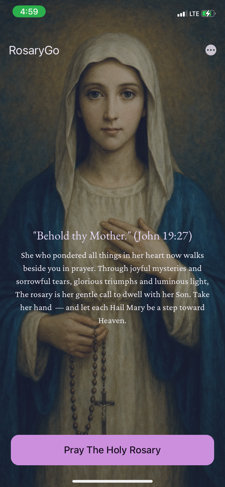
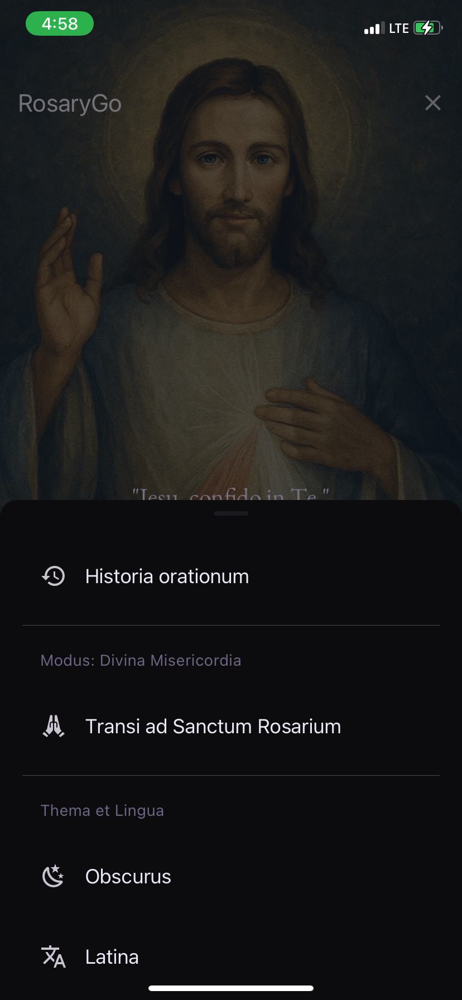
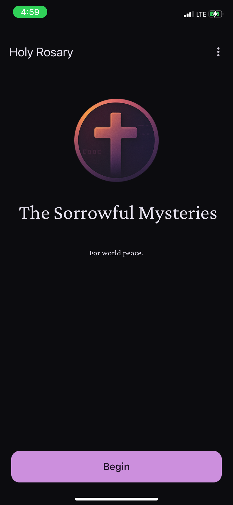
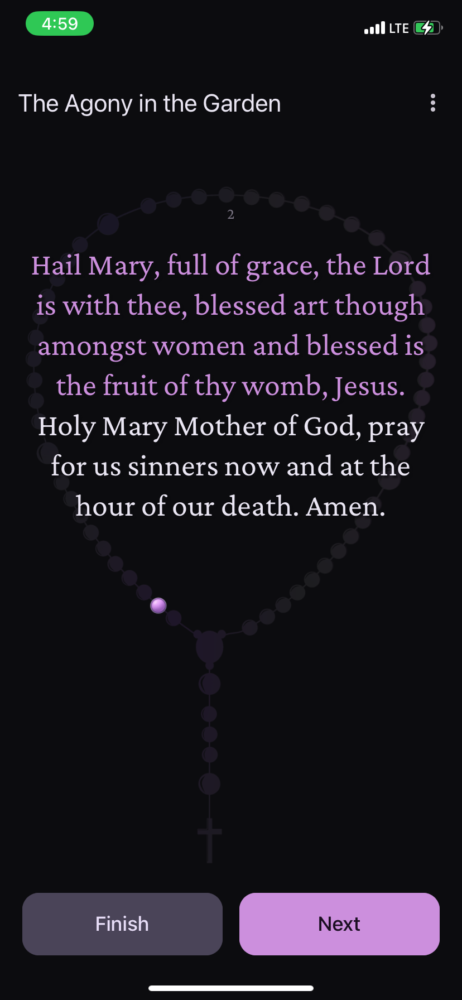
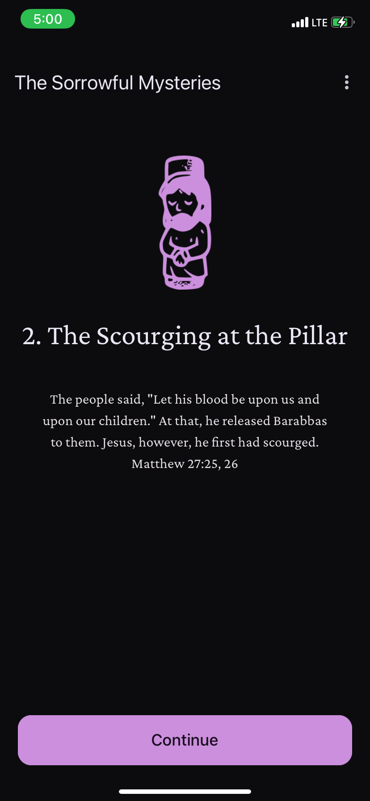
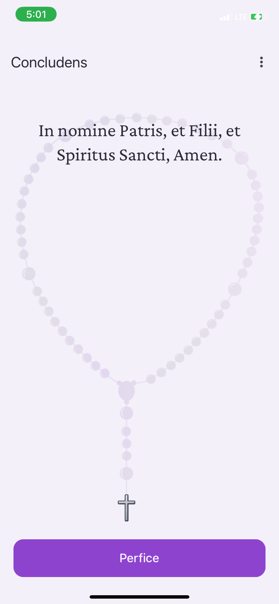

# RosaryGo

**Pray the Rosary. Embrace Divine Mercy. Anywhere, Anytime.**

RosaryGo is a beautifully crafted, fully offline Catholic prayer companion that guides users through the **Holy Rosary** and the **Divine Mercy Chaplet**. Designed to be immersive, intuitive, and deeply spiritual, RosaryGo combines elegant UI with prayerful structure — ideal for both new and seasoned devotees.

---

## ✨ Features

- 🕊️ **Holy Rosary & Divine Mercy Modes** – Guided, step-by-step prayer journeys.
- 🧘‍♂️ **Prayer Intentions** – Optional intention input for each prayer session.
- 🕯️ **Rosary Bead Visuals** – Realistic rosary progression visuals via layered images.
- 📖 **Interactive Steps** – Includes mystery intros, prayers, and completion tracking.
- 📜 **Prayer History** – Log of past sessions with duration and intention.
- 🌍 **Multilingual Support** – Powered by `i18n-js` and `expo-localization`.
- 🎨 **Light & Dark Themes** – With user-selectable preferences.
- 🕊️ **Offline First** – Fully functional without internet access.
- 📱 **Minimal, Clean UI** – Designed for a calm and focused prayer experience.

---

## 📸 Screenshots

<p align="center">
  
  
  
  
  
  
</p>

---

## 🚀 Getting Started

### 📱 For Users

RosaryGo is available on major app stores — just download and start praying. No account. No distractions. Just prayer.

### 💻 For Developers

RosaryGo was built using modern tools in the **Expo Managed Workflow**. Contributions are welcome! Here's how to get started:

#### 1. Clone the repo

```bash
git clone https://github.com/newben420/RosaryGo.git
cd rosarygo
```

#### 2. Install dependencies

```bash
npx expo install
```

3. Run in development

```bash
npx expo start
```

---

## 🛠️ Tech Stack

 - React Native (latest via Expo)
 - Expo (Managed Workflow)
 - React Native Paper – UI library for Material Design
 - Reanimated v3+ – For performant animations
 - React Navigation
 - Gorhom Bottom Sheet – Smooth modal interactions
 - i18n-js + expo-localization – Multilingual support
 - expo-sqlite – Local session history

---

## 🤝 Contributing

We welcome contributions in prayer data, translations, UI tweaks, performance fixes, and even feature suggestions.
1.	Fork the repository
2.	Create your branch: git checkout -b my-feature
3.	Commit your changes: git commit -m "Added X feature"
4.	Push to the branch: git push origin my-feature
5.	Open a pull request

Please ensure all new features are respectful of the spiritual purpose of the app.

---

## 🧑‍💻 Maintainers

Developed and maintained by **[Gbiang Benedict](https://nym.name.ng)**.

---

## 🙏 Acknowledgements

- The Catholic Church for centuries of preserved prayer tradition.
- Contributors and testers helping shape RosaryGo.
- All users praying daily — this app is for you.

---

## 📄 License

MIT License.

--- 

## 💬 Contact

Questions, suggestions or blessings?
Reach out via issues or email: gbiangb@gmail.com

---

## 🏆 Achievements & Spiritual Milestones (Coming Soon)

In future builds, the app will include a meaningful Achievements & Milestones system to gently encourage consistent prayer and personal spiritual growth.

These milestones are designed not as gamification, but as faith-centered reflections of progress — encouraging users to deepen their relationship with prayer and devotion.

### 🏆 Planned Categories

- **📅 Streaks & Consistency** E.g. “Completed a Rosary Daily for 7 Days”, “Prayed Every Sunday This Month”
- **📿 Depth of Practice** E.g. “Completed All Mysteries”, “Prayed with an Intention”
- **🧘 Guided Reflections** E.g. “Completed Joyful Mysteries with Meditation”, “Listened to Sorrowful Audio Reflection”
- **🎁 Devotional Challenges** E.g. “Completed a 54-Day Novena”, “Feast Day Devotion Completed”

### 📌 Design Philosophy

- **Spiritually Uplifting** — Encourages deeper prayer, not just progress
- **Non-Intrusive** — Quietly tracks milestones in the background
- **Respectful UX** — Subtle visual cues, no gamification language

### 🧱 Planned Architecture

- Session data (date, mystery, intention, language) stored via SQLite
- A MilestoneService observes prayer history and triggers unlocks
- Unlocked milestones appear in a dedicated “Milestones” section
- Modal pop-ups celebrate progress with subtle animations and blessings

---

“The Rosary is the weapon for these times.”
— St. Padre Pio